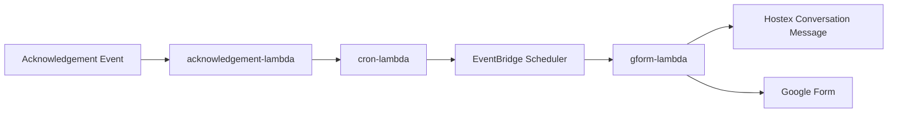

# STR Form Automation

Serverless automation for sending a pre-filled guest information Google Form to short-term rental guests before check-in.

The project is organized as a small set of AWS Lambda functions that work together with the Hostex API, EventBridge Scheduler, and Google Forms.

## Overview

When a reservation is acknowledged, this project:

1. Receives the reservation payload.
2. Looks up the reservation in Hostex.
3. Schedules a future job a configurable number of days before check-in.
4. Sends the guest a Hostex conversation message containing a pre-filled Google Form link.

## Architecture



## Repository Layout

```text
.
├── acknowledgement-lambda/
├── cron-lambda/
├── form-lambda/
├── gform-lambda/
└── main.tf
```

## Lambda Functions

### `acknowledgement-lambda`

Thin entrypoint that accepts an incoming event and asynchronously invokes `cron-lambda`.

Current behavior:

- Reads `event["body"]`
- Invokes the Lambda named by `CRON_LAMBDA`
- Returns `200 Accepted`

### `cron-lambda`

Fetches reservation details from Hostex and creates a one-time EventBridge Scheduler job.

Current behavior:

- Looks up a reservation by `reservation_code`
- Extracts check-in, check-out, and property data
- Schedules `gform-lambda` to run `DAYS_BEFORE` days before check-in
- Falls back to `now + 15 minutes` if the computed time is already in the past
- Deletes the schedule automatically after it runs

### `gform-lambda`

Builds a pre-filled Google Form URL and sends it to the guest via the Hostex conversation thread.

Current behavior:

- Generates a Google Form link containing the reservation code
- Fetches the reservation conversation ID and guest name from Hostex
- Sends a formatted message to the Hostex conversation

### `form-lambda`

Scaffold directory for another Lambda, but `app.py` is currently empty.

## Environment Variables

### `acknowledgement-lambda`

- `CRON_LAMBDA`: Name of the Lambda function to invoke asynchronously

### `cron-lambda`

- `HOSTEX_API_TOKEN`: Hostex API token
- `DAYS_BEFORE`: Number of days before check-in to schedule the guest form message
- `GFORM_LAMBDA_ARN`: ARN of the Lambda triggered by EventBridge Scheduler

Implementation note:

- The EventBridge Scheduler target role ARN is currently hard-coded in [`cron-lambda/app.py`](/Users/adriancorujo/Desktop/STR-Form-Automation/cron-lambda/app.py:46).

### `gform-lambda`

- `HOSTEX_API_TOKEN`: Hostex API token

## Local Development

Prerequisites:

- Python 3.11
- Docker with `buildx`
- AWS CLI configured for the target account

Each Lambda is packaged as a container image based on `public.ecr.aws/lambda/python:3.11`.

Install dependencies locally if needed:

```bash
cd cron-lambda
python3 -m venv .venv
source .venv/bin/activate
pip install -r requirements.txt
```

You can run handlers locally with sample events, for example:

```bash
cd gform-lambda
python3 - <<'PY'
from app import lambda_handler
print(lambda_handler({"reservation_code": "ABC123"}, None))
PY
```

## Deployment

Deployment is currently handled by per-service `deploy.py` scripts:

- [`acknowledgement-lambda/deploy.py`](/Users/adriancorujo/Desktop/STR-Form-Automation/acknowledgement-lambda/deploy.py:1)
- [`cron-lambda/deploy.py`](/Users/adriancorujo/Desktop/STR-Form-Automation/cron-lambda/deploy.py:1)
- [`gform-lambda/deploy.py`](/Users/adriancorujo/Desktop/STR-Form-Automation/gform-lambda/deploy.py:1)

These scripts build a Linux AMD64 image, tag it for ECR, push it, and update the corresponding Lambda function.

Typical flow:

```bash
cd cron-lambda
python3 deploy.py
```

## Infrastructure

The repository includes a root [`main.tf`](/Users/adriancorujo/Desktop/STR-Form-Automation/main.tf:1), but it is currently empty. Infrastructure appears to be managed outside this repo or is still being set up.

## Notes

- The Google Form ID is currently hard-coded in [`gform-lambda/app.py`](/Users/adriancorujo/Desktop/STR-Form-Automation/gform-lambda/app.py:23).
- The guest message template is defined inline in [`gform-lambda/app.py`](/Users/adriancorujo/Desktop/STR-Form-Automation/gform-lambda/app.py:6).
- `form-lambda` is not implemented yet.
